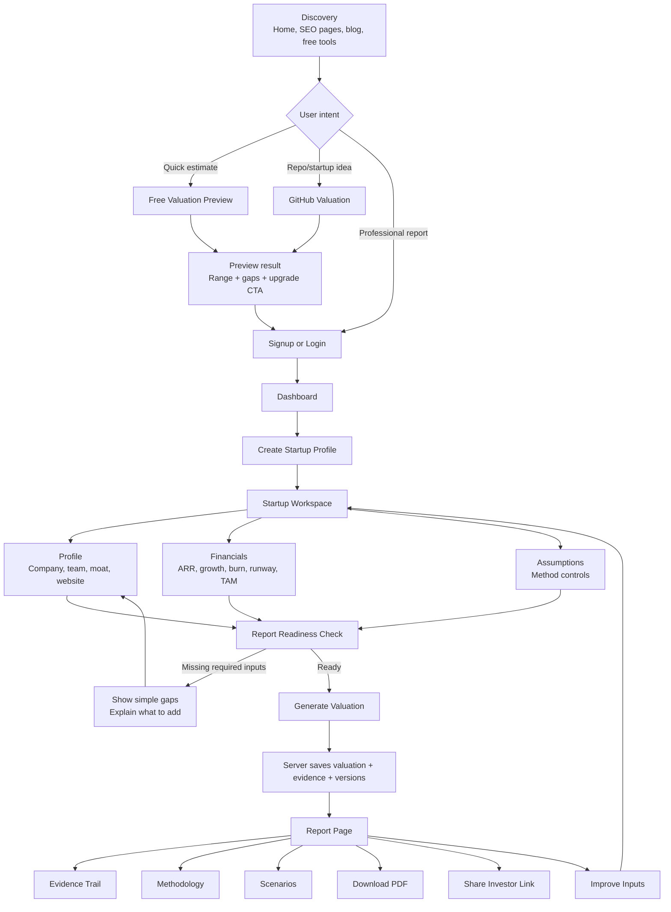
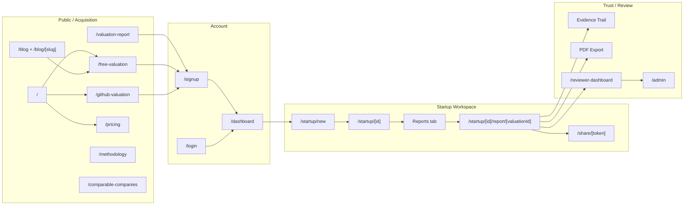
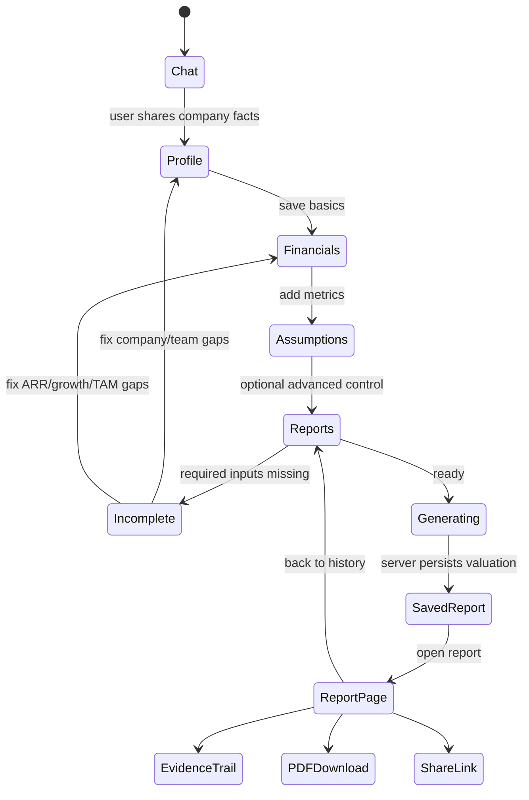
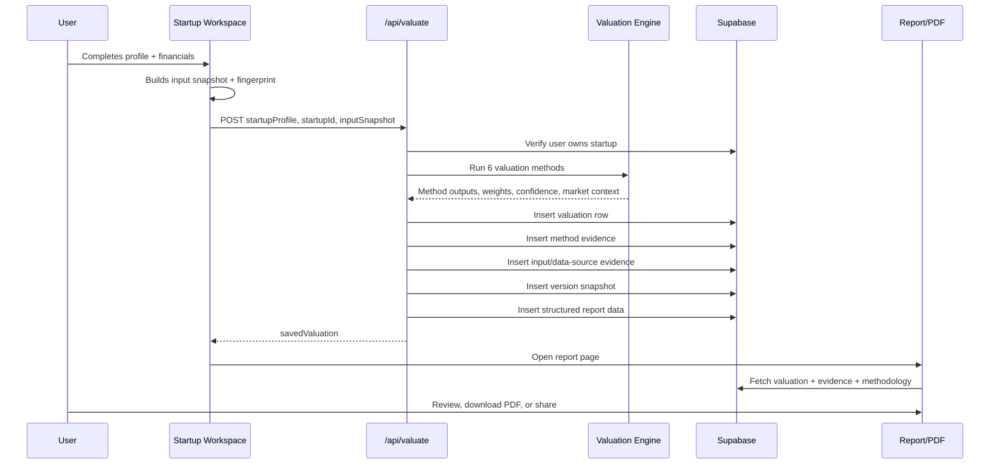
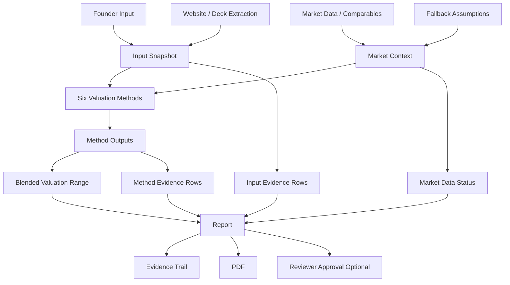
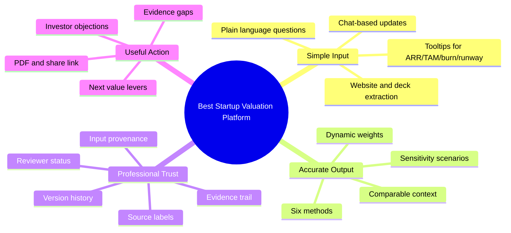

# Evaldam AI User Journey And UX Flow

This maps how a founder, advisor, or reviewer should move through Evaldam AI. The product goal is simple on the surface and rigorous underneath: users should not need valuation expertise to create a credible, evidence-backed startup valuation report.

## 1. End-To-End Journey

## 2. Product Surface Map

## 3. Startup Workspace UX Flow

## 4. Valuation And Evidence Pipeline

## 5. Trust Layer

## 6. Beginner-Friendly UX Principles

## 7. Ideal User Experience In Plain English

1. User arrives from Google, blog, or recommendation.
2. User tries a free valuation or signs up directly.
3. User creates a startup profile with normal business facts.
4. Evaldam explains missing inputs in plain English.
5. User generates a valuation when enough evidence exists.
6. Evaldam saves the valuation and all evidence server-side.
7. User sees a valuation range, confidence, methods, assumptions, gaps, and next steps.
8. User downloads or shares a professional report.
9. User improves weak inputs and regenerates a stronger version.
10. Optional reviewer approval turns the report from system-generated to professionally reviewed.

## 8. What The User Should Feel

- "I do not need to understand valuation jargon to start."
- "The result is not a random AI answer."
- "Every number has a reason."
- "I know what data is weak."
- "I can show this to investors without embarrassment."
- "If I need more confidence, I know exactly what to improve."

## 9. Next UX Upgrades

1. Add a guided onboarding wizard before the full workspace.
2. Add inline explainers for ARR, TAM, burn, runway, gross margin, customer concentration.
3. Add a report readiness score before generation.
4. Add document upload proof for financials, pitch deck, cap table, and customer traction.
5. Add verified/unverified badges beside each key input.
6. Add reviewer-approved badge and locked final valuation state.
7. Add a one-page investor summary view separate from the full PDF.
